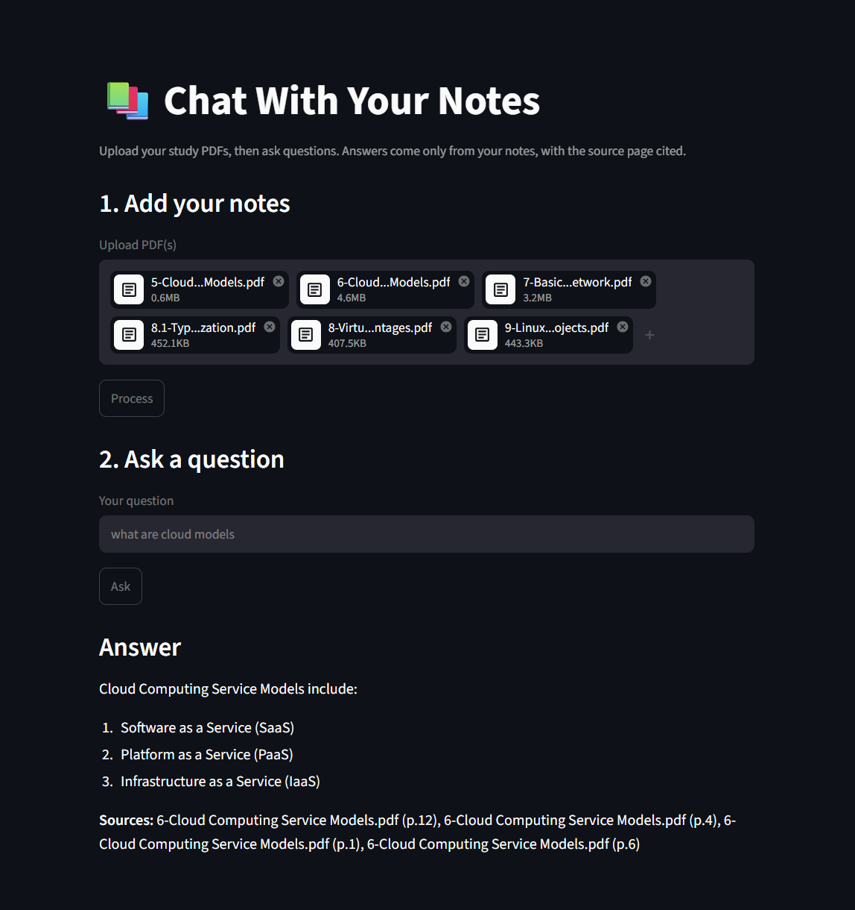

# Chat with Notes - v1

Ask questions about your study PDFs and get answers grounded **only** in your notes, with the source page cited. Built on a local vector store (ChromaDB), local embeddings (SentenceTransformers), and a Groq-hosted LLM.




## How it works
1. **Ingest** — PDFs are split into overlapping ~500-word chunks, embedded locally, and stored in ChromaDB with `{source_file, page_number}` metadata.
2. **Retrieve** — your question is embedded and matched against the top chunks.
3. **Answer** — a Groq LLM answers using only those chunks, or replies *"I couldn't find that in your notes."* — then cites the source pages.

## Setup Instructions

### 1. Prerequisites
- Python 3.10+
- Git

### 2. Clone the Repository
```bash
git clone <repository-url>
cd chat-with-notes
```

### 3. Create and Activate Virtual Environment
We use a virtual environment named `chat-with-notes` matching the project name:
```powershell
# Windows PowerShell
python -m venv chat-with-notes
.\chat-with-notes\Scripts\activate
```

### 4. Install Dependencies
```bash
pip install -r requirements.txt
```

### 5. Environment Variables
To use the LLM features, you'll need to obtain your own Groq API key.
Copy `.env.example` to `.env` and fill in your API key:
```bash
cp .env.example .env
```
*(Note: When deploying online, e.g. on Streamlit Cloud, you would set this as an environment secret instead of using a `.env` file).*


## Usage

### Run the web app (recommended)
```bash
streamlit run app.py
```
Upload PDFs in the browser → click **Process** → ask questions → get answers with source pages.

### Command line
Ingest PDFs from the `notes/` directory:
```bash
python ingest.py --notes-dir notes
```
Inspect top retrieved chunks for a question:
```bash
python ingest.py --notes-dir notes --query "your question here"
```
Get a full LLM answer with sources:
```bash
python rag.py "your question here"
```
